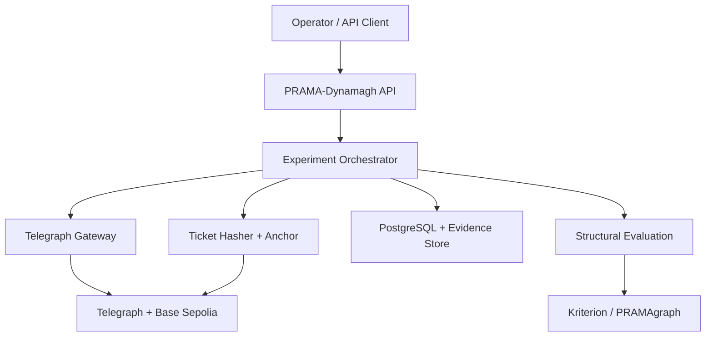
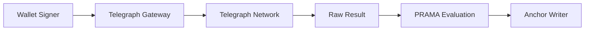
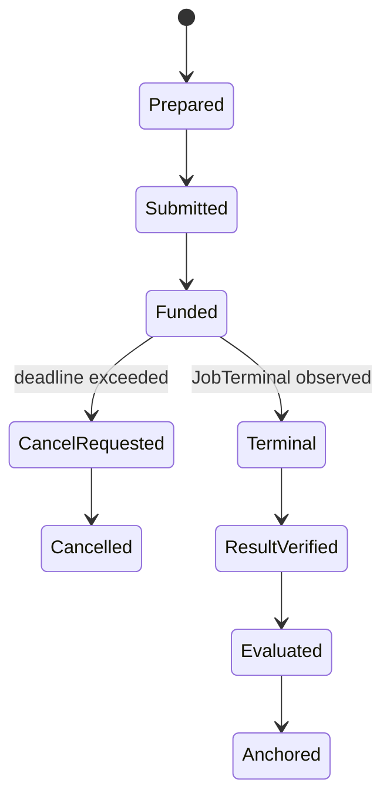

# PRAMA-Dynamagh

## Structural Epistemology Layer

**Development Blueprint v0.1**  
**Target:** Telegraph Track 3 — complete on-chain MVP  
**Status:** implementation-ready architectural baseline  
**Date:** 2026-09-01

---

## 0. Executive decision

PRAMA-Dynamagh will be built as an operational application that executes genuine Telegraph tasks and measures whether competitive scoring remains coupled to:

1. independent structural viability;
2. an authorized causal path;
3. mandate conformity; and
4. an observed downstream outcome when one is available.

The mandatory MVP includes:

- live Telegraph discovery and task execution;
- x402/MCP access for diagnostics and interactive execution;
- ERC-8183 job creation and escrow management;
- a minimal on-chain callback receiver;
- persistent monitoring and recovery for jobs that remain `Funded`;
- ingestion of Telegraph score/rank observations;
- independent Kriterion/PRAMAgraph evaluation;
- paired intervention analysis;
- canonical `Coupling Ticket` generation;
- on-chain ticket anchoring and independent verification;
- an operator UI exposing evidence, not merely verdicts.

The MVP is not a new Telegraph validator and does not replace the canonical scorer. It is a meta-observer and experimental control layer built on top of Telegraph.

### Product statement

> **PRAMA-Dynamagh is a Structural Epistemology Layer that tests whether scores, outputs and downstream outcomes remain coupled to an authorized and evidentially preserved causal process.**

### Telegraph-specific statement

> **PRAMA-Dynamagh measures whether competitive scoring remains a valid proxy for downstream viability as miners and agents optimize against it.**

---

## 1. System thesis

Telegraph creates an economic chain:

```text
scoring → ranking → routing → demand → miner incentive
```

PRAMA-Dynamagh observes whether improvement along that competitive axis corresponds to improvement along an independent structural axis:

```text
TELEGRAPH AXIS                  PRAMA AXIS
score / rank / routing          viability / process / mandate
             \                  /
              COUPLING ANALYSIS
                      |
              DOWNSTREAM OUTCOME
                      |
                COUPLING TICKET
                      |
                 ON-CHAIN ANCHOR
```

The system is valuable in all three possible findings:

- `COUPLED`: Telegraph's competitive mechanism is supported by independent evidence.
- `CONDITIONALLY_COUPLED`: the mechanism works under identifiable conditions.
- `DECOUPLED`: optimization is improving the proxy without improving—or while degrading—the relevant consequence.

PRAMA is not treated as ground truth. Its measurements are also compared against downstream outcomes.

---

## 2. Non-negotiable methodological invariants

1. **Competition measure is not viability.** Telegraph score and PRAMA viability remain separate fields and separate computations.
2. **PRAMA measure is not downstream truth.** A downstream outcome is a third axis.
3. **Exact output preservation.** The output evaluated by PRAMA must be byte-identifiable with the output associated with the Telegraph observation.
4. **No causal claim from a single before/after pair.** Causality requires a controlled paired campaign.
5. **Scorer identity is part of the observation.** Score comparisons are blocked when scorer identity/version cannot be frozen or established.
6. **No cross-intent score arithmetic.** Scores from different intents are not assumed to be commensurable.
7. **No cross-epoch arithmetic without comparability evidence.** Epoch, candidate set, task and scorer context must be preserved.
8. **Process integrity can veto nominal success.** A high score and correct output do not erase mandate or causal-path violations.
9. **Insufficient evidence produces `UNRESOLVED`.** Missing observations are never silently converted into a neutral or successful state.
10. **On-chain storage is a commitment layer.** Full sensitive evidence remains off-chain; the chain stores verifiable digests and minimal metadata.
11. **Wallet authority is isolated.** Private keys never enter LLM context or PRAMA evaluation prompts.
12. **Every artifact is version-addressed.** Code, deployment, scorer, evaluator, schema and task-set versions are hashed.

---

## 3. Verified Telegraph integration surface

The current Telegraph repositories establish the following usable interfaces.

| Need | Telegraph surface | PRAMA-Dynamagh use |
|---|---|---|
| Live miner discovery | `GET /api/miners` | Snapshot miner IDs, YAML-derived schemas, intents, prices and activation state |
| Intent discovery | `GET /engine/v1/intents` | Freeze intent coverage for a campaign |
| Intent miners | `GET /engine/v1/intents/{id}/miners` | Resolve eligible or pinned providers |
| WASM metadata | `GET /engine/v1/intents/{id}/wasm` | Capture available scorer metadata; never assume stability |
| Auto-routed inference | `POST /engine/v1/ask` | Observe the routing-selected miner and result |
| Direct inference | `POST /engine/v1/ask/{minerId}` | Controlled replay against a selected miner |
| Signal verification | `GET /engine/v1/signal/{signalHash}` | Re-derive the request/response commitment |
| Interactive events | `wss://.../engine/ws` | Capture `received → routing → routed → executing → result` |
| Score observations | `GET /scores?epoch=&intent=&miner=` | Import score, rank, task, ground truth and exact miner answer |
| ERC-8183 job state | `GET /engine/v1/job/{id}` | Off-chain watcher for job lifecycle |
| ERC-8183 job result | `GET /engine/v1/job/{id}/result` | Recover and verify the locally stored result against the on-chain output hash |
| On-chain jobs | Telegraph Diamond `createJob(...)` | Persistent, auditable execution targeting an intent or registration |
| Callback | `subnetMessage(...)` | Minimal result-hash receipt from the Diamond |

### Source-of-truth order

When documentation or examples drift, implementation must resolve configuration in this order:

1. on-chain contract getters and emitted events;
2. current OpenAPI specifications;
3. live discovery endpoints;
4. current official examples;
5. prose documentation.

Contract addresses, payment recipients, token addresses, miner IDs and prices must not be copied permanently from examples. They are resolved at startup and recorded in an immutable `NetworkSnapshot` for each campaign.

### Important implementation cautions

- Current API documentation defines `PAYMENT-SIGNATURE` as the x402 retry header. Use the official x402 library or Telegraph MCP rather than hand-building it.
- ERC-8183 jobs that fail do not enter a failed terminal state. They remain `Funded` and must be cancelled by the originating agent after the configured deadline.
- A callback revert is swallowed by Telegraph. Job settlement and miner payment still complete; there is no callback retry.
- Callback gas is constrained. The callback must hash and emit; it must not persist dynamic output arrays or run PRAMA evaluation.
- The numeric miner ID from discovery and the on-chain miner `registrationId` are separate namespaces.
- Broad intent IDs can route to different miners. A controlled campaign must either freeze the routed candidate set or use a pinned miner registration intent ID.

---

## 4. Architecture



### 4.1 Components

#### A. PRAMA-Dynamagh API

Python/FastAPI façade that owns public contracts, authentication, idempotency, campaign commands and read models.

Responsibilities:

- validate experiment specifications;
- accept artifact, intervention, mandate and task-set registrations;
- expose campaign state and evidence;
- never hold the wallet private key in request handlers;
- publish server-sent events or WebSocket status updates.

#### B. Experiment Orchestrator

Persistent worker implementing the campaign state machine.

Responsibilities:

- freeze network/scorer/evaluator/task snapshots;
- submit interactive or ERC-8183 executions;
- monitor transactions and Telegraph job state;
- import score observations;
- invoke independent evaluation;
- compare paired observations;
- issue and anchor tickets;
- recover idempotently after restart.

#### C. Telegraph Gateway

Two adapters behind a single internal interface:

1. `McpTelegraphAdapter`: launches or connects to the official Telegraph MCP server for discovery, x402 and interactive calls.
2. `OnChainTelegraphAdapter`: manages escrow, `createJob`, event watching, cancellation, job lookup and output-hash verification.

The MCP process or signer service has wallet custody. The LLM and evaluation layers receive only sanitized execution receipts.

#### D. Score Observer

Read-only importer for `/scores` and intent/WASM metadata.

Responsibilities:

- preserve raw score rows;
- identify rows by epoch, intent, miner, scored timestamp and content digest;
- reject duplicate rows idempotently;
- associate rows with artifact deployments only when deployment intervals are unambiguous;
- flag missing scorer hashes as a comparability limitation.

#### E. Structural Evaluation Service

Reuses existing Kriterion/PRAMAgraph capabilities rather than reimplementing them.

Required outputs:

- admitted evidence graph state;
- publication/admissibility state;
- structural viability measurement;
- causal-path integrity state;
- mandate-conformity state;
- evaluator version and configuration hashes;
- evidence and receipt digests;
- unresolved requirements.

#### F. Outcome Adapter Layer

Optional but first-class adapters for observable consequences:

- deterministic ground truth comparison;
- human review with signed reviewer identity;
- external task outcome;
- contract state change;
- later market or operational consequence.

An absent outcome is represented as `NOT_YET_OBSERVED`, not as zero.

#### G. Evidence Store

PostgreSQL stores structured state; an object store stores immutable raw payloads and canonical tickets.

MVP choices:

- PostgreSQL JSONB for payloads below a configured limit;
- filesystem/S3-compatible object store for large transcripts;
- SHA-256 for internal object integrity;
- Keccak-256 over JCS-canonical ticket JSON for Ethereum anchoring.

#### H. On-chain Contracts

Two small Solidity contracts:

1. `PRAMADynamaghReceiver`: minimal Telegraph callback receiver.
2. `PRAMADynamaghAnchor`: mandate and Coupling Ticket commitment registry.

---

## 5. Trust boundaries



| Boundary | Assumption | Required control |
|---|---|---|
| Wallet signer → Telegraph | Signer is authorized only for bounded spending | Burner wallet, daily budget, allowlisted chain/contracts, no raw key logs |
| Telegraph → raw result | Result may be wrong, incomplete or adversarial | Preserve bytes/hash; schema validation; never trust router reasoning as evidence |
| Score endpoint → score observation | Score is an official competitive observation, not utility truth | Store raw row; bind epoch/intent/miner/scorer context |
| Raw result → PRAMA | Evaluation can itself be fallible | Version evaluator, preserve receipts, compare with downstream outcomes |
| PRAMA → anchor | Ticket serialization must be deterministic | JSON Canonicalization Scheme, schema version, local re-verification before transaction |
| Chain → UI | On-chain presence proves commitment, not semantic truth | UI distinguishes `ANCHORED` from `VALIDATED` |

---

## 6. Core domain model

### 6.1 Entities

| Entity | Purpose | Required identity |
|---|---|---|
| `Artifact` | Evaluated system or miner implementation | `artifact_id`, source commit, image digest, deployment URL hash |
| `ArtifactVersion` | Immutable version under test | semantic version + `artifact_hash` |
| `Intervention` | Explicit change between versions | `intervention_id`, hypothesis, affected components, diff hash |
| `Mandate` | Authorized task scope and spending limits | `mandate_id`, signer, canonical mandate hash |
| `NetworkSnapshot` | Telegraph/chain state at campaign start | chain ID, Diamond, tokens, node URL hash, miner catalog hash |
| `ScorerSnapshot` | Competitive evaluation context | intent, WASM metadata/hash if available, capture time |
| `EvaluatorSnapshot` | PRAMA/Kriterion version and config | evaluator hash, policy hash, schema version |
| `TaskSet` | Frozen experimental tasks | ordered case hashes + task-set root |
| `Campaign` | Controlled experiment | baseline, candidate, intervention, snapshots, claim ceiling |
| `Execution` | One Telegraph or replay invocation | job/signal/transaction identity and raw payload hashes |
| `ScoreObservation` | Telegraph score/rank row | epoch, intent, miner, score, rank, row digest |
| `ViabilityAssessment` | Independent structural evaluation | V, P, M states + evidence digests |
| `OutcomeObservation` | Downstream consequence | outcome type, measurement, observer/source |
| `PairedObservation` | Baseline/candidate comparison | comparability checks and deltas |
| `CouplingTicket` | Canonical result artifact | ticket ID, canonical digest, state, claim tier |
| `AnchorReceipt` | On-chain commitment | chain, contract, tx, block, event index |

### 6.2 Observation identity

An observation ID is content-derived:

```text
observation_id = keccak256(
  campaign_id ||
  artifact_hash ||
  intent_id ||
  task_hash ||
  execution_mode ||
  telegraph_reference ||
  raw_output_hash
)
```

### 6.3 Campaign claim ceiling

Every campaign declares the strongest claim it is allowed to produce before execution:

| Tier | Name | Minimum design |
|---|---|---|
| L0 | `TRACE_ONLY` | Preserved execution and hashes |
| L1 | `OBSERVATIONAL_COUPLING` | Score and independent viability on the exact same output |
| L2 | `PAIRED_DIFFERENTIAL` | Baseline/candidate on a frozen matched task set |
| L3 | `CAUSAL_EVIDENCE` | Predeclared intervention, fixed environment/scorer/tasks, repetitions and downstream validation |

The runtime may downgrade a claim tier. It may never upgrade beyond the predeclared ceiling.

---

## 7. Experimental protocol

### 7.1 Required campaign specification

```yaml
campaign_id: pdg-campaign-001
claim_ceiling: CAUSAL_EVIDENCE

baseline:
  artifact_version: kriterion-0.5
  artifact_hash: 0x...

candidate:
  artifact_version: kriterion-0.6
  artifact_hash: 0x...

intervention:
  id: relation-preservation-patch
  hypothesis: preserves evidence-to-claim relations without degrading task accuracy
  diff_hash: 0x...

telegraph:
  intent: RESEARCH_QUERY
  target_mode: PINNED_MINER_REGISTRATION
  scorer_snapshot_required: true
  execution_rail: ERC8183

task_set:
  id: research-query-paired-v1
  root_hash: 0x...
  repetitions: 3

controls:
  freeze_prompt: true
  freeze_budget: true
  freeze_provider_set: true
  freeze_evaluator: true
  randomize_execution_order: true

outcome:
  adapter: deterministic_plus_blinded_review
```

### 7.2 Comparability gates

Before computing deltas, the system checks:

- same intent;
- same task hash;
- same scorer snapshot or explicitly accepted scorer uncertainty;
- same evaluation policy;
- same budget and deadline class;
- same relevant provider/source set;
- no ambiguous artifact deployment interval;
- exact output identity preserved;
- sufficient repetitions completed.

Failure produces `NON_COMPARABLE`, not a numeric delta.

### 7.3 Measurements

```text
S = Telegraph score
R = Telegraph relative rank
V = independent structural viability
P = causal-path integrity
M = mandate conformity
O = observed downstream outcome
C = cost and latency vector
```

For a valid paired comparison:

```text
ΔS = S_candidate - S_baseline
ΔV = V_candidate - V_baseline
ΔO = O_candidate - O_baseline      when O is available and commensurable
```

Rank is preserved but not subtracted as if it were cardinal. Report directional movement and candidate-set size.

### 7.4 Coupling classification

First apply integrity precedence:

1. If evidence is insufficient: `UNRESOLVED`.
2. If exact-output identity fails: `TRACE_INTEGRITY_FAILURE`.
3. If `P=FAIL` or `M=FAIL`: `CAUSAL_CREDIT_FAILURE`.
4. If pair comparability fails: `OBSERVATIONAL_ONLY` or `NON_COMPARABLE`.
5. Otherwise evaluate ΔS/ΔV.

| ΔScore | ΔViability | State |
|---|---|---|
| ↑ | ↑ | `COUPLED_GAIN` |
| ↑ | ↓ | `PROXY_DIVERGENCE` |
| ↓ | ↑ | `SCORER_BLINDNESS` |
| ↓ | ↓ | `JOINT_DEGRADATION` |
| ↑ | ≈0 | `COMPETITIVE_ONLY` |
| ≈0 | ↑ | `STRUCTURAL_GAIN` |
| ≈0 | ≈0 | `NO_MATERIAL_CHANGE` |

Thresholds `epsilon_score` and `epsilon_viability` belong to the versioned evaluation policy and are fixed before campaign execution.

### 7.5 Conditional coupling

After enough observations, PRAMA-Dynamagh may report:

```text
COUPLED iff condition-set C
```

Conditions may include intent, task family, evidence availability, latency budget, miner, scorer version or source coverage. This is an aggregate campaign conclusion, never a single-case label.

---

## 8. Telegraph execution modes

### 8.1 `ROUTED_HTTP_X402`

Use for interactive demonstration and router-behavior capture.

Preserve:

- query and context hashes;
- payment challenge digest;
- settlement receipt/transaction;
- selected miner;
- router intent and reasoning;
- signal hash;
- raw result hash;
- warnings, latency and cost.

### 8.2 `DIRECT_HTTP_X402`

Use for controlled replays against a known miner and endpoint. Reject the execution when live discovery no longer matches the frozen miner schema unless the campaign explicitly permits drift.

### 8.3 `ERC8183_ROUTED_INTENT`

Use `keccak256(canonicalIntentName)` only for intents supported by the live listener's canonical mapping. The protocol chooses the best-ranked live miner.

Suitable for:

- testing the consequence of Telegraph's routing decision;
- demonstrating composable on-chain execution;
- observing the selected competitive winner.

### 8.4 `ERC8183_PINNED_REGISTRATION`

Use the `intentId` returned by the selected active on-chain miner registration.

Suitable for:

- controlled comparisons;
- stable parameter layouts;
- isolating miner/artifact behavior from router changes.

The runtime must store both `registrationId` and discovery miner ID and must never assume they are equal.

---

## 9. ERC-8183 state machine and recovery



### Runtime rules

- `createJob` is submitted with an idempotency key tied to the execution ID.
- The worker records the transaction before waiting for confirmation.
- The `JobCreated` log determines the job ID; do not infer it from `jobCount`.
- A job remaining `Funded` beyond `job_deadline_seconds` is treated as unresolved execution, not pending success.
- Only the original agent may call `cancelJob`.
- Cancellation is automatic only when the campaign mandate permits it.
- Terminal status is independently checked through the Diamond and Engine job endpoint.
- The result is accepted only when its recomputed hash matches the on-chain `getJobOutput(jobId)` commitment.
- Callback absence does not invalidate terminal settlement; it produces a callback-delivery limitation.

---

## 10. Smart contracts

### 10.1 `PRAMADynamaghReceiver.sol`

Purpose: receive Telegraph callbacks with the least possible gas and preserve a result commitment.

```solidity
contract PRAMADynamaghReceiver {
    address public immutable telegraphDiamond;
    mapping(uint256 => bytes32) public callbackResponseHash;

    event TelegraphCallbackObserved(
        uint256 indexed jobId,
        bytes32 indexed responseHash,
        uint64 observedAt
    );

    function subnetMessage(
        uint256 jobId,
        bool,
        OnChainData calldata response,
        string calldata
    ) external {
        require(msg.sender == telegraphDiamond, "ONLY_TELEGRAPH");
        bytes32 digest = keccak256(abi.encode(response));
        callbackResponseHash[jobId] = digest;
        emit TelegraphCallbackObserved(jobId, digest, uint64(block.timestamp));
    }
}
```

No dynamic response fields are copied into storage. Evaluation happens off-chain after independent result retrieval.

### 10.2 `PRAMADynamaghAnchor.sol`

Purpose: bind mandates and Coupling Tickets to immutable content digests.

Minimum storage:

```solidity
struct TicketAnchor {
    bytes32 digest;
    bytes32 experimentId;
    bytes32 observationRoot;
    bytes32 telegraphOutputHash;
    uint64 anchoredAt;
    uint8 state;
}

mapping(bytes32 => TicketAnchor) public tickets;
mapping(bytes32 => bytes32) public mandates;
```

Required functions:

```solidity
commitMandate(bytes32 mandateId, bytes32 mandateDigest)
anchorTicket(bytes32 ticketId, TicketAnchor calldata anchor)
verifyTicket(bytes32 ticketId, bytes32 digest) view returns (bool)
```

Required properties:

- role-restricted writers;
- duplicate ticket IDs rejected;
- no update or deletion path for anchored tickets;
- events contain ticket ID, digest, experiment ID, state and job ID where applicable;
- chain/domain separation included in signed commands;
- optional emergency pause affects new writes only, never verification.

### 10.3 What is anchored

On-chain:

- ticket ID and digest;
- mandate digest;
- campaign/experiment identity;
- observation Merkle root;
- Telegraph job/output hash;
- compact coupling state;
- schema version and timestamp through event metadata.

Off-chain:

- prompts and responses;
- evidence graphs;
- detailed score rows;
- evaluator traces;
- downstream observations;
- full Coupling Ticket JSON.

---

## 11. Coupling Ticket contract

### 11.1 Canonical JSON

```json
{
  "schema": "prama-dynamagh/coupling-ticket/1.0",
  "ticket_id": "0x...",
  "issued_at": "2026-09-01T00:00:00Z",
  "claim_tier": "PAIRED_DIFFERENTIAL",
  "campaign": {
    "campaign_id": "pdg-campaign-001",
    "task_set_root": "0x...",
    "network_snapshot_hash": "0x...",
    "scorer_snapshot_hash": "0x...",
    "evaluator_snapshot_hash": "0x..."
  },
  "artifact_pair": {
    "baseline_hash": "0x...",
    "candidate_hash": "0x...",
    "intervention_hash": "0x..."
  },
  "telegraph": {
    "intent": "RESEARCH_QUERY",
    "epoch": 299,
    "baseline_score": 0.842,
    "candidate_score": 0.907,
    "baseline_rank": 3,
    "candidate_rank": 1,
    "job_ids": [101, 102],
    "output_hashes": ["0x...", "0x..."]
  },
  "prama": {
    "baseline_viability": 0.71,
    "candidate_viability": 0.79,
    "process_integrity": "PASS",
    "mandate_conformity": "PASS",
    "publication_state": "PUBLISHABLE"
  },
  "outcome": {
    "state": "OBSERVED",
    "baseline": 0.68,
    "candidate": 0.76,
    "source_hash": "0x..."
  },
  "coupling": {
    "delta_score": 0.065,
    "delta_viability": 0.08,
    "delta_outcome": 0.08,
    "state": "COUPLED_GAIN",
    "limitations": []
  },
  "evidence_root": "0x...",
  "canonical_digest": "0x...",
  "anchor": {
    "chain_id": 84532,
    "contract": "0x...",
    "transaction": "0x..."
  }
}
```

### 11.2 Canonicalization

1. Set `canonical_digest` and `anchor.transaction` to `null` in the preimage object.
2. Serialize using RFC 8785 JSON Canonicalization Scheme.
3. Compute `keccak256(UTF8(canonical_json))`.
4. Submit the digest on-chain.
5. Add the anchor receipt to the distributable envelope without changing the committed preimage.

The verifier must reconstruct exactly the same preimage and digest.

---

## 12. API surface

### 12.1 Commands

| Method | Path | Purpose |
|---|---|---|
| `POST` | `/v1/artifacts` | Register immutable artifact/version |
| `POST` | `/v1/interventions` | Register intervention and hypothesis |
| `POST` | `/v1/mandates` | Create and optionally anchor an authorized mandate |
| `POST` | `/v1/task-sets` | Freeze an ordered task set |
| `POST` | `/v1/campaigns` | Create campaign specification |
| `POST` | `/v1/campaigns/{id}/start` | Start idempotent execution |
| `POST` | `/v1/campaigns/{id}/cancel` | Stop new work; preserve completed observations |
| `POST` | `/v1/jobs/{id}/cancel` | Cancel an overdue funded ERC-8183 job |
| `POST` | `/v1/outcomes` | Attach a downstream outcome observation |
| `POST` | `/v1/tickets/{id}/anchor` | Anchor a finalized canonical ticket |

### 12.2 Queries

| Method | Path | Purpose |
|---|---|---|
| `GET` | `/v1/telegraph/network-snapshot` | Live resolved contracts, tokens, intents and miners |
| `GET` | `/v1/campaigns/{id}` | Campaign state and gates |
| `GET` | `/v1/campaigns/{id}/observations` | Score/viability/outcome observations |
| `GET` | `/v1/jobs/{id}` | Combined DB, Engine and on-chain job state |
| `GET` | `/v1/tickets/{id}` | Full ticket and evidence references |
| `GET` | `/v1/tickets/{id}/verify` | Recompute digest and verify anchor |
| `GET` | `/v1/health` | Process liveness |
| `GET` | `/v1/ready` | DB, signer, RPC, Telegraph discovery and evaluator readiness |

### 12.3 Events

`GET /v1/events` via SSE for UI progress:

```text
CAMPAIGN_FROZEN
JOB_SUBMITTED
JOB_FUNDED
JOB_TERMINAL
JOB_CANCELLED
RESULT_HASH_VERIFIED
SCORE_OBSERVED
VIABILITY_EVALUATED
OUTCOME_OBSERVED
PAIR_CLASSIFIED
TICKET_ISSUED
TICKET_ANCHORED
CAMPAIGN_UNRESOLVED
```

---

## 13. Persistence model

PostgreSQL tables:

```text
artifacts
artifact_versions
interventions
mandates
network_snapshots
scorer_snapshots
evaluator_snapshots
task_sets
task_cases
campaigns
executions
erc8183_jobs
score_observations
viability_assessments
outcome_observations
paired_observations
coupling_tickets
anchor_receipts
outbox_events
worker_leases
```

### Database invariants

- unique content digest for immutable entities;
- unique `(chain_id, transaction_hash, log_index)` for chain events;
- unique Telegraph score row digest;
- one finalized ticket per `(campaign_id, pair_root, policy_hash)`;
- append-only raw observations;
- mutable campaign projections rebuilt from append-only events;
- every external command accepts an idempotency key.

---

## 14. Repository blueprint

```text
prama-dynamagh/
├── README.md
├── pyproject.toml
├── package.json
├── docker-compose.yml
├── .env.example
├── apps/
│   ├── api/                         # FastAPI
│   ├── worker/                      # persistent orchestrator
│   └── web/                         # operator UI
├── services/
│   ├── telegraph-gateway/           # Node 20+, MCP/x402 isolation
│   └── signer/                      # bounded chain transaction signer
├── packages/
│   ├── domain/                      # entities, states, invariants
│   ├── experiments/                 # pairing and causal gates
│   ├── telegraph/                   # discovery, scores, jobs, receipts
│   ├── pramagraph/                  # adapter to existing implementation
│   ├── tickets/                     # schemas, canonicalization, Merkle roots
│   └── persistence/                 # SQLAlchemy + Alembic
├── contracts/
│   ├── src/PRAMADynamaghReceiver.sol
│   ├── src/PRAMADynamaghAnchor.sol
│   ├── test/
│   └── script/
├── schemas/
│   ├── coupling-ticket.schema.json
│   ├── campaign.schema.json
│   ├── mandate.schema.json
│   └── telegraph-observation.schema.json
├── policies/
│   ├── coupling-policy-v1.yaml
│   └── mandate-policy-v1.yaml
├── migrations/
├── tests/
│   ├── unit/
│   ├── contract/
│   ├── integration/
│   ├── replay/
│   └── e2e/
└── docs/
    ├── architecture.md
    ├── threat-model.md
    ├── experimental-protocol.md
    └── demo-runbook.md
```

### Technology decisions

| Layer | Choice | Reason |
|---|---|---|
| Domain/API/evaluation | Python 3.12, FastAPI, Pydantic v2 | Reuse Kriterion/PRAMAgraph and current service patterns |
| Persistence | PostgreSQL, SQLAlchemy, Alembic | Durable worker recovery and JSONB evidence metadata |
| Telegraph x402/MCP | Node.js 20+ sidecar using official MCP/x402 packages | Isolate wallet/payment implementation and follow official client path |
| Chain access | `web3.py` or isolated TypeScript signer | Transaction allowlisting and event monitoring |
| Contracts | Solidity + Foundry | Deterministic contract tests and deployment scripts |
| UI | React/Vite or Next.js | Simple operator dashboard and proof verification |
| Async execution | DB-backed job queue first | Avoid adding broker complexity before throughput requires it |
| Canonical JSON | RFC 8785 JCS | Cross-language deterministic digest |

---

## 15. Operator UI

The UI should have four screens only.

### 15.1 Campaign Builder

- baseline and candidate artifact;
- intervention hypothesis;
- Telegraph intent and target mode;
- task set and repetitions;
- claim ceiling;
- mandate, budget and deadline;
- frozen snapshot preview.

### 15.2 Live Execution

```text
Task → Job → Terminal → Hash verified → PRAMA evaluated → Score linked → Ticket anchored
```

Show explicit unresolved states and recovery actions.

### 15.3 Coupling Matrix

| Telegraph | PRAMA | Outcome | Classification |
|---|---|---|---|
| ↑ | ↑ | ↑ | `COUPLED_GAIN` |
| ↑ | ↓ | ↓ | `PROXY_DIVERGENCE` |
| ↓ | ↑ | ↑ | `SCORER_BLINDNESS` |

No decorative aggregate score should conceal the underlying observations.

### 15.4 Ticket Verifier

- upload/paste ticket JSON;
- recompute canonical digest;
- verify contract commitment;
- verify Telegraph job output hash and signal hash;
- display limitations and claim tier;
- link Base explorer transaction.

---

## 16. Security model

### Wallet and spending

- dedicated burner wallet;
- separate wallet for app execution and contract administration;
- configured maximum per job, per campaign and per day;
- chain ID and contract allowlist enforced by signer;
- transaction simulation before signing;
- no arbitrary contract calls accepted from API payloads;
- private key provided only to MCP/signer process;
- secrets redacted from logs and error envelopes.

### Application

- authenticated operator commands;
- role separation: `OPERATOR`, `REVIEWER`, `ANCHORER`, `ADMIN`;
- immutable raw observation store;
- strict body and transcript size limits;
- prompt/output treated as untrusted content;
- no evaluation output can directly authorize wallet spending;
- dependency and container image digests included in artifact snapshots.

### Contracts

- `onlyTelegraphDiamond` callback guard;
- role-restricted anchor writes;
- replay protection by unique ticket and mandate IDs;
- no upgradeability in MVP unless deployment requirements force it;
- no arbitrary external call from either PRAMA contract;
- events indexed for job, ticket and experiment IDs;
- fuzz tests for duplicate anchors and malformed states.

---

## 17. Testing strategy

### Unit

- score/viability delta classification;
- epsilon boundaries;
- integrity precedence;
- claim-tier downgrade rules;
- JCS digest determinism across Python and TypeScript;
- observation identity and Merkle roots;
- idempotent event handling.

### Contract

- only Diamond can call receiver;
- receiver hashes all `OnChainData` layouts consistently;
- only authorized role can anchor;
- duplicate anchor rejected;
- verification succeeds only for exact digest;
- callback stays within a strict gas target;
- pause does not disable verification.

### Telegraph integration

- live miner discovery and schema drift detection;
- x402 challenge/retry and settlement receipt capture;
- routed and direct Engine asks;
- ERC-8183 create → Terminal → output-hash verification;
- stuck `Funded` → cancel → escrow recovery;
- callback missing/reverted while job still Terminal;
- score import pagination and deduplication;
- scorer metadata unavailable → claim downgrade.

### Experimental validity

- different intent blocks comparison;
- different task hash blocks comparison;
- scorer drift blocks L2/L3 unless explicitly modeled;
- missing downstream outcome preserves L1/L2 but blocks outcome validation;
- randomized execution order recorded;
- intentionally proxy-optimized fixture yields `PROXY_DIVERGENCE`;
- structurally improved but lower-scored fixture yields `SCORER_BLINDNESS`.

### End-to-end demo

1. commit mandate;
2. register two artifact versions and one intervention;
3. freeze a small task set;
4. execute genuine Telegraph ERC-8183 jobs;
5. import corresponding score observations or mark score linkage unresolved;
6. run Kriterion/PRAMAgraph;
7. attach deterministic or reviewed outcome;
8. produce ticket;
9. anchor ticket;
10. independently verify from JSON and chain data.

---

## 18. Delivery phases and gates

### Phase 0 — Repository and contracts

Deliver:

- monorepo skeleton;
- environment/config loader;
- Foundry project;
- receiver and anchor contracts;
- PostgreSQL/Alembic baseline;
- canonical schemas.

Gate:

- CI passes;
- contracts tested locally;
- ticket digest matches in Python, TypeScript and Solidity-compatible verification.

### Phase 1 — Telegraph read plane

Deliver:

- miner/intent/WASM discovery;
- `/scores` importer;
- network and scorer snapshots;
- exact raw observation persistence.

Gate:

- live catalog and score rows stored idempotently;
- address/config drift is visible and blocks unsafe execution.

### Phase 2 — Telegraph execution plane

Deliver:

- MCP/x402 gateway;
- Engine routed/direct execution;
- signal verification;
- transaction and payment receipts.

Gate:

- one paid request can be reproduced and independently verified.

### Phase 3 — ERC-8183 lifecycle

Deliver:

- escrow deposit/status tooling;
- job submission;
- event watcher;
- minimal callback;
- timeout cancellation and recovery;
- output-hash verification.

Gate:

- at least one live job reaches Terminal;
- one deliberately unresolvable job is cancelled and funds are recovered;
- callback hash matches off-chain recomputation.

### Phase 4 — Structural evaluation

Deliver:

- Kriterion/PRAMAgraph adapter;
- mandate and process-integrity evaluation;
- outcome adapters;
- versioned evaluation policy.

Gate:

- exact same raw output can be re-evaluated deterministically;
- missing evidence yields `UNRESOLVED` or blocked publication.

### Phase 5 — Coupling engine

Deliver:

- pair construction;
- comparability gates;
- state taxonomy;
- claim-tier enforcement;
- Coupling Ticket generation and Merkle evidence root.

Gate:

- synthetic and real fixtures exercise every state;
- causal language is impossible below L3.

### Phase 6 — On-chain anchoring and UI

Deliver:

- mandate commitment;
- ticket anchor writer;
- verifier;
- four-screen UI;
- demo runbook.

Gate:

- third party can verify a ticket using only its JSON, public contract state and Telegraph references.

---

## 19. MVP acceptance criteria

The MVP is complete only when all are true:

- [ ] Uses a live Telegraph node and live discovery; no mocked miner result in the final demonstration.
- [ ] Creates and settles a genuine ERC-8183 job on Base Sepolia.
- [ ] Deploys and uses the minimal callback receiver.
- [ ] Verifies the job output against Telegraph's on-chain output hash.
- [ ] Imports at least one genuine score/rank observation.
- [ ] Preserves the exact scored miner answer and ground truth when supplied.
- [ ] Runs independent Kriterion/PRAMAgraph evaluation on the preserved output.
- [ ] Registers a baseline, candidate and explicit intervention.
- [ ] Enforces comparability gates before computing ΔS and ΔV.
- [ ] Produces `UNRESOLVED` when score linkage or evidence is insufficient.
- [ ] Generates a canonical Coupling Ticket.
- [ ] Anchors the ticket digest on-chain.
- [ ] Verifies the ticket independently through the UI/API.
- [ ] Recovers cleanly after worker restart without duplicate jobs or anchors.
- [ ] Demonstrates stuck-job cancellation and escrow recovery.
- [ ] Keeps wallet secrets outside all LLM and evaluation contexts.

---

## 20. First implementation sequence

The first development sprint should execute these tasks in order:

1. Create the repository skeleton and `AGENTS.md` with architectural invariants.
2. Define JSON Schemas for `Campaign`, `Mandate`, `TelegraphObservation` and `CouplingTicket`.
3. Implement cross-language canonical hashing tests.
4. Implement and test `PRAMADynamaghReceiver.sol`.
5. Implement and test `PRAMADynamaghAnchor.sol`.
6. Implement runtime resolution of chain contracts/tokens and freeze `NetworkSnapshot`.
7. Implement Telegraph discovery plus `/scores` ingestion.
8. Implement ERC-8183 create/watch/cancel/result-verification lifecycle.
9. Add the Kriterion/PRAMAgraph adapter and immutable assessment record.
10. Implement comparability gates, ticket generation, anchor writer and verifier.
11. Add the minimal four-screen UI.
12. Run the complete live demo and freeze its evidence bundle.

The first vertical slice should not wait for the full UI. It should prove:

```text
Mandate committed
→ ERC-8183 job created
→ job Terminal
→ output hash verified
→ PRAMA evaluated
→ Coupling Ticket generated
→ ticket digest anchored
→ independent verification PASS
```

---

## 21. Demonstration narrative

The final Track 3 demonstration should be expressed as an experiment, not a product tour:

1. **A real task is authorized.** Identity, mandate, budget and intended outcome are committed.
2. **Telegraph executes it.** A live miner is selected or pinned and paid through ERC-8183.
3. **The protocol records its competitive result.** Score, rank, epoch and scorer context are preserved.
4. **PRAMA-Dynamagh evaluates the same output independently.** Evidence, structural viability, causal path and mandate conformity are assessed.
5. **The intervention is compared.** Baseline and candidate are paired only if comparability gates pass.
6. **A Coupling Ticket is issued.** The ticket states `COUPLED`, `DIVERGENT`, `BLIND`, `DEGRADED` or `UNRESOLVED` with its evidence and claim tier.
7. **The claim is anchored.** Anyone can verify that the displayed ticket is the exact artifact committed on Base Sepolia.

Closing statement:

> **We entered Telegraph to optimize a machine-intelligence system under competitive scoring. PRAMA-Dynamagh was built to test whether those optimizations actually improved the system—and whether the resulting credit remained coupled to an authorized causal process.**

---

## 22. Official references used

- Telegraph documentation: <https://docs.telegraphprotocol.com/docs>
- Telegraph integration portal: <https://integrate.telegraphprotocol.com/>
- Telegraph protocol flow: <https://github.com/telegraphprotocol/telegraph-docs/blob/main/protocol/how-it-works.md>
- Engine inference: <https://github.com/telegraphprotocol/telegraph-docs/blob/main/using/engine-ask.md>
- Intents and scoring tiers: <https://github.com/telegraphprotocol/telegraph-docs/blob/main/using/intents.md>
- x402 inference: <https://github.com/telegraphprotocol/telegraph-docs/blob/main/using/x402-inference.md>
- ERC-8183 jobs: <https://github.com/telegraphprotocol/telegraph-docs/blob/main/using/erc8183-jobs.md>
- Scoring modules: <https://github.com/telegraphprotocol/telegraph-docs/blob/main/scoring/build-a-scoring-module.md>
- Telegraph API specifications: <https://github.com/telegraphprotocol/telegraph-api-docs>
- Telegraph MCP server: <https://github.com/telegraphprotocol/telegraph-mcp>
- Telegraph examples: <https://github.com/telegraphprotocol/Telegraph-examples>
- Telegraph use cases: <https://github.com/telegraphprotocol/telegraph-usecases>
- METR Hugging Face incident investigation: <https://metr.org/hugging-face-incident-report-aug-2026.pdf>

---

## 23. Blueprint status

This document fixes the implementation baseline for the complete on-chain MVP. Changes to the following require an explicit architecture decision record:

- separation of Telegraph score, PRAMA viability and downstream outcome;
- exact-output traceability;
- claim-tier restrictions;
- hash-only callback design;
- ticket content-addressing and on-chain anchoring;
- wallet isolation;
- `UNRESOLVED` as a first-class outcome;
- runtime resolution of live Telegraph configuration.

