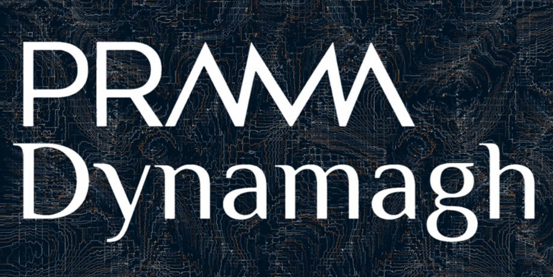

# PRAMA-Dynamagh

**A structural epistemic layer built on Telegraph Protocol for turning mandates into evidence-bound machine decisions.**



```text
Mandate
   ↓
Telegraph / x402
   ↓
Evidence
   ↓
PRAMAgraph
   ↓
Decision
   ↓
Verifiable Ticket
```

PRAMA-Dynamagh does not treat an answer as knowledge simply because it was returned by a provider.

Instead, it preserves provenance, converts acquired signals into attributable evidence, evaluates their structural admissibility, and keeps the resulting machine decision reconstructible from its source artifacts.

The result is a decision pipeline in which acquisition, evidence, evaluation, decision, and verification remain explicitly separated.

---

## Live application

**https://prama-dynamagh.up.railway.app/**

---

## The problem, in plain language

Autonomous agents can now acquire information programmatically, pay for it, and act on the result.

But receiving an answer is not the same as having evidence for a decision.

In a conventional agent pipeline, a returned signal may be consumed immediately by the next step. That creates several problems:

- the source and economic context of the information can become detached from the decision
- a valid response does not necessarily mean the evidence is sufficient for the decision being made
- when something goes wrong, reconstructing exactly what information produced the decision can be difficult
- later verification often proves that an execution happened, but not whether the evidence actually justified the decision

The problem is therefore not only obtaining machine intelligence.

It is preserving the relationship between:

```text
what was requested
        ↓
what was acquired
        ↓
what counted as evidence
        ↓
what decision was made
```

## The PRAMA-Dynamagh approach

PRAMA-Dynamagh inserts a structural epistemic layer between acquired intelligence and machine action.

Instead of:

> Receive a response → use it directly

the pipeline becomes:

1. **Acquire** intelligence through Telegraph / x402.
2. Convert the returned signal into attributable **Evidence**, preserving its source, provider, cost, hashes, and execution context.
3. **Evaluate** whether that evidence is structurally admissible for the decision being constructed.
4. Produce the resulting **Decision**.
5. Issue a deterministic **Decision Ticket** that binds the decision to its evidence lineage and allows it to be verified and replayed later.

```text
Mandate
  ↓
Telegraph / x402
  ↓
Evidence
  ↓
PRAMAgraph
  ↓
Decision
  ↓
Verifiable Ticket
```

The objective is simple:

**a machine decision should remain bound to the evidence from which it was made.**

## In one sentence

**PRAMA-Dynamagh turns acquired machine intelligence into evidence-bound, reconstructible decisions.**

> **Don't let autonomous agents act on answers alone. Make their decisions traceable back to evidence.**

---

## Core idea

Telegraph provides machine-native intelligence acquisition:

```text
Intent
→ provider discovery / routing
→ paid signal
→ provenance
```

PRAMA-Dynamagh governs what happens after that acquisition:

```text
Signal
→ Evidence
→ structural evaluation
→ Decision
→ verifiable Ticket
```

This separation is deliberate.

**Provenance is not truth.**

**Verification is not evaluation.**

**A decision must remain reconstructible from evidence.**

---

## What PRAMA-Dynamagh demonstrates

The production system has executed real Telegraph workflows including:

- paid Telegraph/x402 acquisitions
- persistent Mandate → Evidence → Evaluation → Decision → Ticket lineage
- structural evidence evaluation through PRAMAgraph
- deterministic Decision Tickets
- deterministic replay from persisted source artifacts
- verified ERC-8183 execution callbacks
- Base Sepolia Ticket anchoring
- authenticated machine-to-machine access
- bounded autonomous execution
- persistent agent identity
- deterministic agent-scoped observation through O_AGENT v0

These are implemented capabilities, not mocked execution paths.

---

## Decision lineage

Each workflow begins with a **Mandate** and preserves the artifacts produced throughout execution.

```text
Mandate
  │
  ├── Acquisition
  │      ├── intent
  │      ├── provider / miner
  │      ├── cost
  │      ├── latency
  │      └── Telegraph signal hash
  │
  ├── Evidence
  │      ├── provenance
  │      ├── content commitment
  │      └── admission state
  │
  ├── Evaluation
  │      └── PRAMAgraph structural assessment
  │
  ├── Decision
  │
  └── Decision Ticket
         ├── deterministic commitment
         ├── source lineage
         └── verification / replay
```

A returned Telegraph signal is therefore not automatically promoted into a machine decision.

It must first pass through the evidence and structural evaluation layers.

---

## Telegraph / x402 integration

PRAMA-Dynamagh uses Telegraph as its acquisition layer.

A successful acquisition preserves execution metadata including:

- requested intent
- selected provider / miner
- signal hash
- returned payload
- cost
- latency
- provenance

Payment occurs through the isolated Gateway boundary.

The acquisition result is then converted into a PRAMA-Dynamagh Evidence artifact and processed independently of the acquisition mechanism itself.

---

## PRAMAgraph

PRAMA-Dynamagh keeps the deterministic Evidence Admission Gate separate from
the PRAMAgraph observation layer.

The Evidence Admission Gate performs the minimal deterministic immediate
admission checks used by the existing workflow.

PRAMAgraph currently includes **O_EVIDENCE_PROVENANCE v0.1**, running the
certified PRAMA Protokol v0.3.0 as a causal structural
provenance-trajectory observer in shadow mode.

The observer reads persisted Mandate → AcquisitionTask → TelegraphCall →
Evidence lineage and does not determine admission or alter the Decision Gate.
Its coordinates do not currently determine admissibility, and they make no
claim about truth, viability, or forecasting.

This is not the complete PRAMAgraph research framework.

This preserves an important distinction:

```text
Source verification
        ≠
Evidence evaluation
        ≠
Decision
```

---

## Verifiable Decision Tickets

A completed decision can produce a deterministic **Decision Ticket**.

The Ticket commits to the deterministic decision core and its evidence lineage while keeping non-deterministic runtime metadata outside the commitment where appropriate.

This allows the decision to be:

- verified independently
- reconstructed from persisted artifacts
- deterministically replayed
- optionally anchored on-chain

The same persisted evidence and decision artifacts reproduce the same deterministic Ticket commitment.

---

## Deterministic replay

PRAMA-Dynamagh includes a replay / verification path that works from persisted artifacts.

Replay does not require another paid Telegraph request.

This makes it possible to inspect whether a previously issued decision can still be reconstructed from the artifacts that originally produced it.

```text
Persisted artifacts
      ↓
Deterministic replay
      ↓
Reconstructed lineage
      ↓
Ticket verification
```

---

## ERC-8183

PRAMA-Dynamagh has demonstrated real ERC-8183 execution on Base Sepolia.

The integration includes:

- job creation
- execution lifecycle tracking
- verified callback reception
- callback/output commitment verification
- promotion of verified output into Evidence
- downstream Decision and Ticket generation

ERC-8183 live writes are disabled by default in the current public production configuration.

---

## Base Sepolia anchoring

Decision Tickets can optionally be anchored on Base Sepolia.

Anchoring does not replace the local deterministic Ticket.

It provides an external commitment to an already constructed Ticket hash.

```text
Decision
   ↓
Deterministic Ticket
   ↓
Ticket hash
   ↓
Optional Base Sepolia anchor
```

---

## Machine-to-machine access

PRAMA-Dynamagh exposes a bounded authenticated M2M rail for autonomous clients.

An authenticated machine client can:

- create a bounded Mandate
- inspect Mandate state
- retrieve resulting Ticket and lineage

The M2M surface does **not** expose:

- signer material
- the private Gateway
- arbitrary payment destinations
- arbitrary transaction calldata
- ERC-8183 creation controls
- Ticket anchoring controls
- generic transaction or deployment interfaces
- autonomy policy mutation

M2M identity is persisted and bound to authenticated execution context.

---

## Bounded autonomous execution

PRAMA-Dynamagh is currently operating a bounded scheduler-originated autonomous workflow in production.

The active policy is constrained by:

- maximum **0.01 USDC per run**
- maximum **3 runs per day**
- concurrency **1**
- minimum cadence **900 seconds**
- G12 reservation, rate-limit, idempotency and fail-closed controls
- ERC-8183 disabled for autonomous execution
- anchoring disabled for autonomous execution

Autonomous execution is therefore active, but explicitly bounded and operator-controlled.

---

## AgentIdentity

The current release introduces persistent **AgentIdentity**.

Agent identity is propagated through execution lineage including:

```text
AgentIdentity
    ↓
Mandate
    ↓
AutonomyRun / M2M execution
    ↓
UsageEvent
    ↓
Decision lineage
    ↓
Ticket
```

Identity resolution is scoped and fail-closed.

This prevents autonomous and M2M execution histories from collapsing into an unattributed shared stream.

---

## O_AGENT v0

PRAMA-Dynamagh also includes **O_AGENT v0**, the first observational component for longitudinal autonomous-agent analysis.

O_AGENT deterministically reconstructs ordered observations from persisted execution artifacts for one AgentIdentity.

It can observe structural facts such as:

- execution order
- origin
- acquisition occurrence
- local decision outcome
- cost
- latency when available
- retries / attempts
- failure and recovery
- recurrence
- budget exposure
- evidence and Ticket completion

Missing telemetry remains explicit rather than being silently imputed.

O_AGENT does **not** decide whether an agent should continue operating.

It is an observation layer only.

This preserves the distinction between an individual epistemic decision and the trajectory produced by repeated autonomous decisions:

> **A sequence of locally valid decisions does not necessarily imply a viable autonomous trajectory.**

Longitudinal trajectory governance remains separate from the existing local Decision Gate.

---

## Public execution safeguards

Public paid execution is protected server-side.

Current safeguards include:

- maximum **0.01 USDC per public workflow**
- global daily spend cap
- atomic PostgreSQL budget reservations
- reservation settlement
- Redis pre-spend coordination
- rate limiting
- idempotency
- bounded attempt behavior
- fail-closed payment controls

These controls apply independently of the public UI.

A client cannot bypass them by changing frontend behavior.

---

## Signer isolation

Private signing authority exists only inside the Gateway service.

```text
Public client / Agent
        ↓
       API
        ↓
      Worker
        ↓
  Private Gateway
        ↓
Telegraph / Base Sepolia
```

The API, Worker, and Frontend do not receive the signing private key.

The Gateway does not expose a generic public transaction or deployment interface.

---

## Production architecture

PRAMA-Dynamagh is deployed as isolated services:

- **Frontend** — public interface
- **API** — Mandates, lineage, M2M and read interfaces
- **Worker** — asynchronous execution
- **Gateway** — private signing and payment boundary
- **PostgreSQL** — persistent execution state and lineage
- **Redis** — rate limiting and pre-spend coordination
- **RabbitMQ** — execution queue

The public frontend communicates with the API while payment authority remains isolated behind the private Gateway boundary.

---

## Current verified capabilities

| Capability | Status |
|---|---|
| Telegraph acquisition | ✅ Production |
| x402 payment | ✅ Production |
| Evidence persistence | ✅ |
| PRAMAgraph evaluation | ✅ |
| Deterministic Decision Ticket | ✅ |
| Deterministic replay | ✅ |
| ERC-8183 execution | ✅ Demonstrated |
| Verified ERC-8183 callback | ✅ Demonstrated |
| Base Sepolia Ticket anchoring | ✅ Demonstrated |
| Authenticated M2M execution | ✅ Production |
| Bounded autonomous execution | ✅ Active in production |
| AgentIdentity | ✅ Production |
| O_AGENT v0 | ✅ Production |
| Longitudinal trajectory intervention | Not yet implemented |

---

## Validation

The submission release has passed:

```text
Backend PostgreSQL-backed tests: 58
Frontend tests:                  2
Gateway tests:                  15
Contract tests:                 10
```

The deployed production release corresponds to the validated submission build.

---

## Local development

The repository contains Dockerized services for:

- `postgres`
- `api`
- `worker`
- `gateway`
- `frontend`

Environment-specific credentials are intentionally excluded from the repository.

Use `.env.example` as the reference for required configuration variables.

A typical local bootstrap is:

```bash
docker compose up --build
```

Some infrastructure dependencies may be configured externally depending on the local environment.

---

## Security

Secrets and production credentials are not committed to the repository.

In particular, production values for the following remain external:

```text
TELEGRAPH_SIGNER_PRIVATE_KEY
PRAMA_GATEWAY_INTERNAL_TOKEN
PRAMA_M2M_API_TOKEN
DATABASE_URL
REDIS_URL
RABBITMQ_URL
```

Only variable names and safe configuration examples should appear in `.env.example`.

---

## Submission release

```text
G0-G12       PASS
G13-A/B      PASS
G13-C        PASS

AgentIdentity  Production
O_AGENT v0     Production

Autonomy       ACTIVE — bounded production policy
ERC-8183       Live writes disabled
```

PRAMA-Dynamagh remains centered on one primary invariant:

**machine decisions should remain bound to the evidence from which they were made.**
